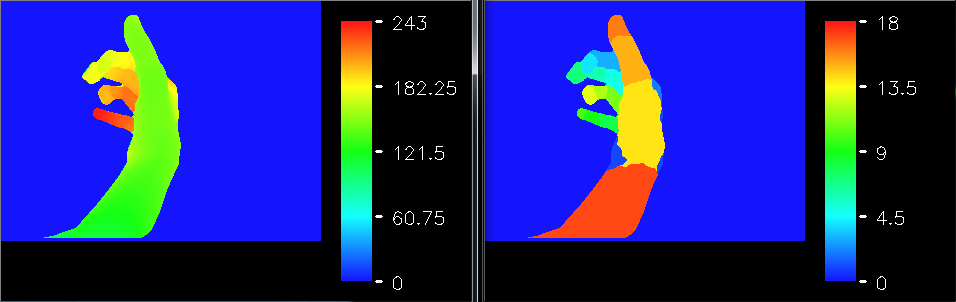
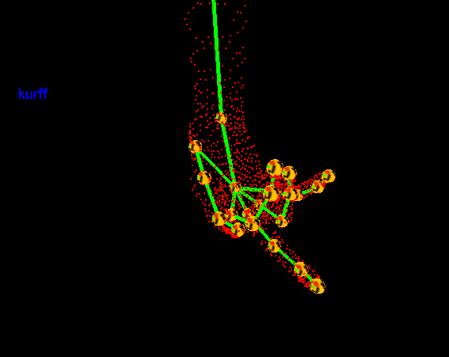
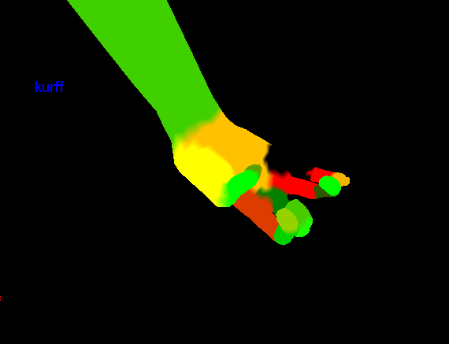

# HandDepthViewer1.0
Depth Image Generation using 3D hand Model

This project describes how to generate depth image using 3D Hand Model

(1): Depth image and its corresponding parts

(2): 3D hand model with point clound

(3): 3D hand model with mesh

